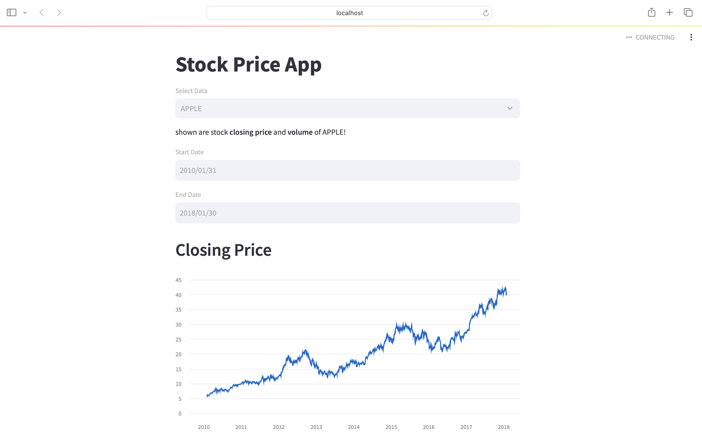

# stock-price-app

An interactive web application built with Streamlit that allows you to explore historical stock price data for Google (GOOGL), Microsoft (MSFT), and Apple (AAPL). You can visualize and analyze the closing prices and trading volumes for these tech giants within a specific date range.

## Features

- Select from three major technology companies: Google, Microsoft, or Apple.
- Set your preferred date range to analyze stock price history.
- Visualize the closing price trends over time.
- Explore trading volume data with intuitive line charts.

## Technologies Used

- [Streamlit](https://www.streamlit.io/): A Python library for creating web apps with minimal effort.
- [yfinance](https://pypi.org/project/yfinance/): A Python library to fetch and analyze historical stock data from Yahoo Finance.
- [Pandas](https://pandas.pydata.org/): Data manipulation and analysis.
- [DateTime](https://docs.python.org/3/library/datetime.html): Python standard library for handling dates and times.

## How to Use

1. Choose a company from the dropdown menu: Google, Microsoft, or Apple.
2. Set the start and end date to specify the date range for your analysis.
3. Observe the closing price trends and trading volumes over the selected date range.
4. Gain insights into the stock price history of the chosen company.

This app is a handy tool for anyone interested in tracking and analyzing the historical performance of technology giants. Explore and visualize the stock market data to make informed investment decisions or simply stay updated on the trends.

[Demo App](#) | [Report Issues](https://github.com/PhilimonNag/stock-price-app/issues) | [Contribute](https://github.com/PhilimonNag/stock-price-app/pulls)

## Screenshot

## Getting Started

To run this app on your local machine, follow these steps:

1. Clone this repository to your computer.
2. Install the required libraries using `pip install -r requirements.txt`.
3. Run the app with `streamlit run app.py`.

Feel free to contribute, suggest improvements, or report issues. Happy analyzing!
